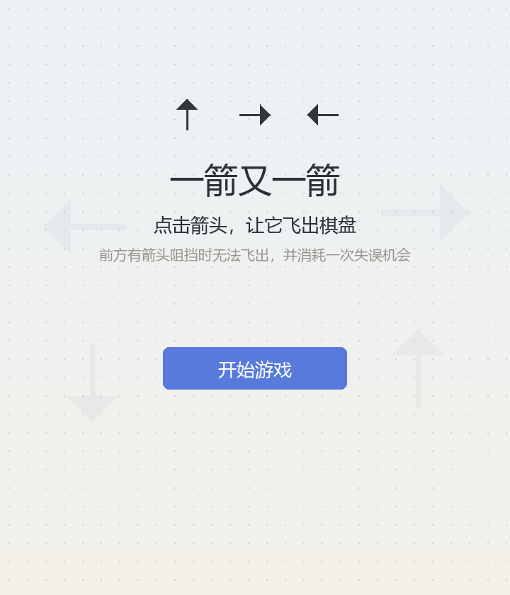
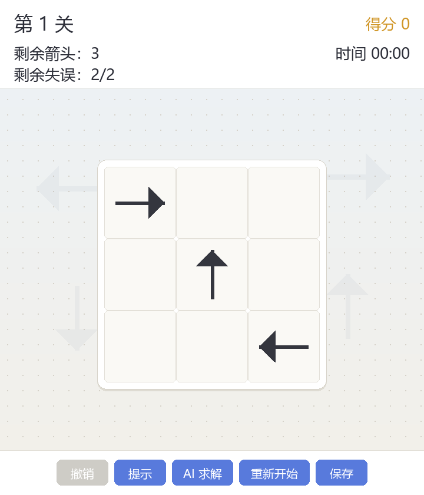
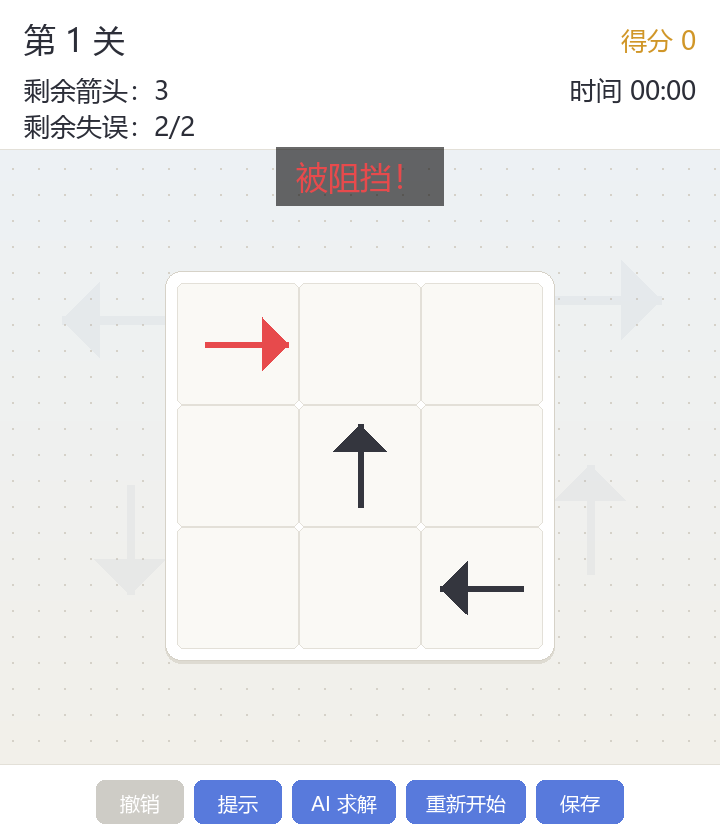
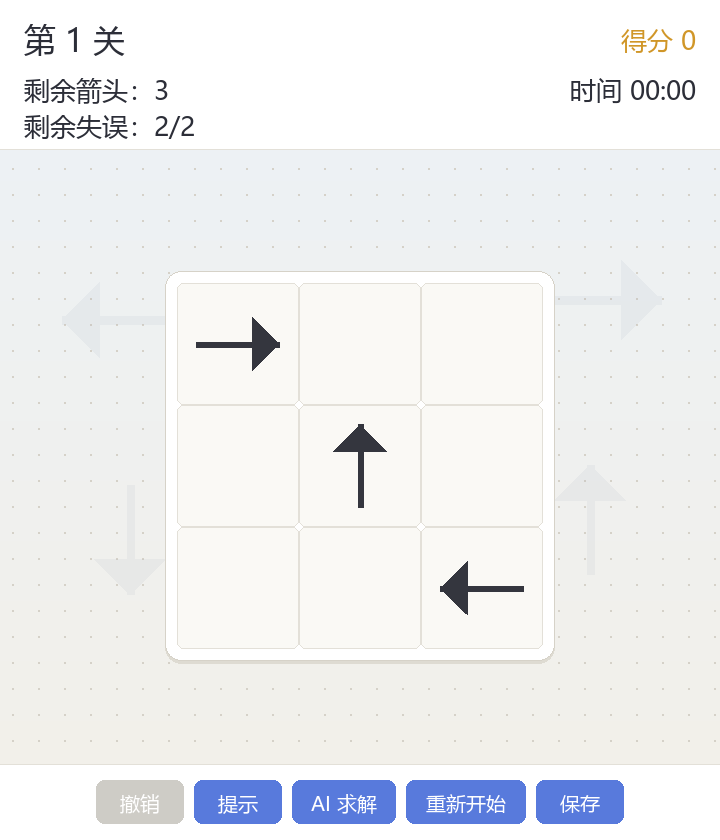
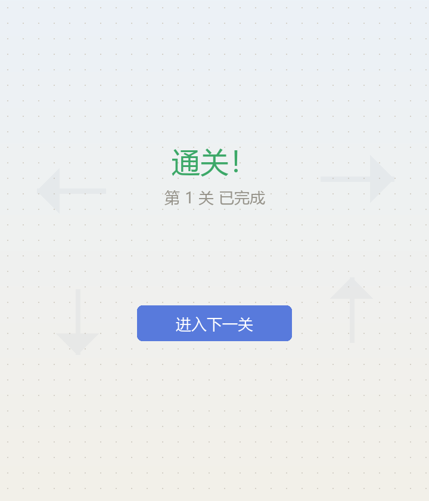
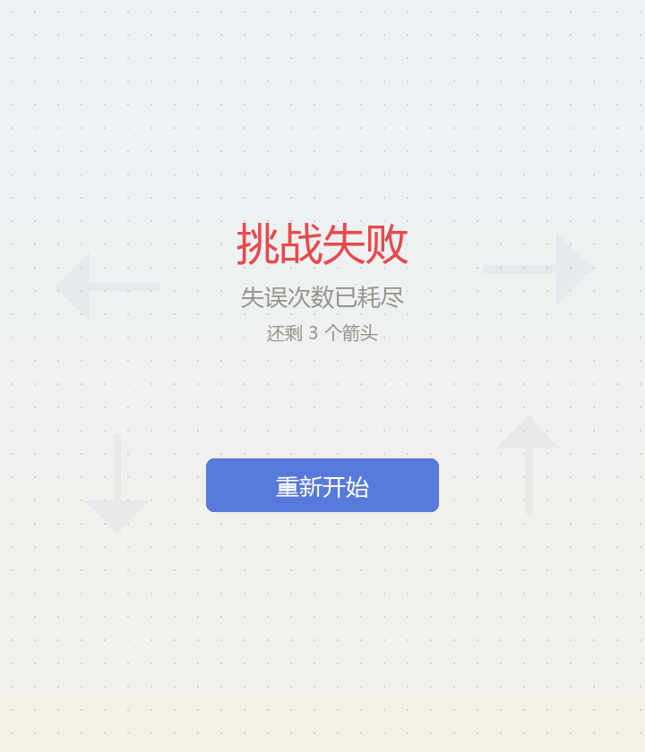

# 一箭又一箭

一款使用 Python + Pygame 开发的点击式箭头解谜小游戏。

## 游戏简介

棋盘网格中放置了朝向上、下、左、右四种方向的箭头。点击某个箭头：

- 若它朝向前方到棋盘边界之间没有其他箭头阻挡，箭头会飞出棋盘并被消除；
- 若路径上存在其他箭头，则无法消除，并产生碰撞反馈（抖动、变红、文字提示），同时消耗一次失误机会。

清空当前关卡全部箭头即可进入下一关；失误次数耗尽则本关失败，可重新开始。本作内置 4 个难度递增、均可通关的关卡。

在完成基础玩法之上，还实现了若干附加功能：

- **撤销上一步**：可回退「成功飞出」或「碰撞失误」，自动恢复箭头 / 失误次数；
- **提示**：高亮当前任意一个可安全飞出的箭头；
- **AI 自动求解**：一键按求解顺序自动消除全部箭头，直接通关演示；
- **计时 / 得分 / 星级**：每关计时，按失误与用时结算单关得分与 1~3 星评价，累计总分；
- **音效**：飞出、碰撞、通关、失败等程序化合成音效（无外部素材）；
- **保存进度**：进度写入本地 `save.json`，主界面可「继续游戏」。

## 开发环境

- Python 3.8+
- Pygame 2.x

## 安装和运行

```bash
# 安装依赖
pip install -r requirements.txt

# 运行游戏
python main.py
```

## 游戏操作说明

- 鼠标左键点击箭头：尝试让它飞出棋盘；
- 点击被阻挡的箭头会消耗失误机会，注意观察箭头方向与阻挡关系；
- 底部工具栏按钮：
  - 「撤销」回退上一步；
  - 「提示」高亮一个可安全飞出的箭头；
  - 「AI 求解」自动通关当前关卡；
  - 「重新开始」当前关卡恢复初始状态；
  - 「保存」把进度写入本地 `save.json`；
- 开始界面可「开始游戏」或（存在存档时）「继续游戏」；
- 清空本关后点击「进入下一关」，失败后点击「重新开始」。

## 游戏截图

### 开始界面



### 游戏界面



### 碰撞反馈



### 箭头飞出



### 通关界面



### 失败界面



## 测试

```bash
python -m pytest tests/ -v
```

## 目录结构

```
task2/
├── main.py           # 入口与主循环
├── game/
│   ├── models.py     # 数据模型（Direction/Arrow/Level）
│   ├── pathing.py    # 路径检测 + 贪心求解器
│   ├── board.py      # 棋盘状态、消除/失误判定、撤销历史
│   ├── levels.py     # 关卡数据
│   ├── state.py      # 状态机、计时、计分、存档序列化
│   ├── config.py     # 常量与自适应布局
│   ├── renderer.py   # pygame 绘制（HUD/工具栏/各界面）
│   ├── audio.py      # 程序化合成音效
│   └── save.py       # 进度存档读写
├── tests/            # 单元测试（含附加功能测试）
├── tools/            # 截图生成等辅助脚本
├── screenshots/      # 游戏截图
└── requirements.txt
```

## 开发说明

本项目借助 AIGC 工具（Claude Code）辅助开发。核心路径检测算法与关卡数据为无 pygame 依赖的纯逻辑实现，可通过单元测试验证；图形界面与动画由 Pygame 完成。
